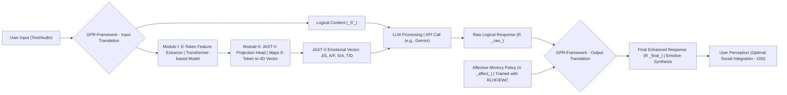
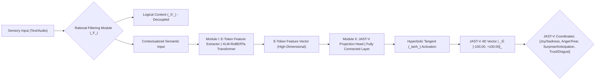
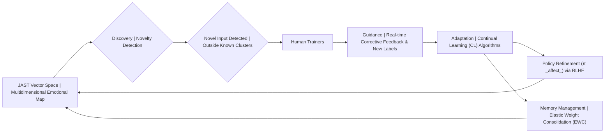

# GPR-Framework: Generative & Programmable Response Framework

## Acknowledgements

We express our profound gratitude to the academic and professional mentors whose expertise and intellectual guidance were instrumental in the successful completion of the **Generative & Programmable Response Framework (GPR-Framework)** project. This work, which sits at the intersection of Affective AI and Continual Learning, was significantly shaped by their direction and support.

We extend our sincere appreciation to **Dr. Utsa Roy**, our College Mentor. His invaluable institutional support and encouragement ensured the project maintained its trajectory from conception to final implementation.

We are deeply indebted to **Dr. Monojit Chattarjee**, our Guiding Mentor, whose specialized technical knowledge, particularly in the domain of _Support Vector Machines (SVM)_ and _machine learning fundamentals_, provided critical oversight. His insightful direction was essential in navigating the architectural complexities of the continual policy training mechanisms within the GPR-Framework.

Finally, special recognition is owed to **Dr. Jhumki Barman**. As a Psychologist, her clinical and behavioral perspective provided the necessary theoretical grounding for the **JAST Emotional AI Framework**. Her input was crucial in ensuring the dimensional emotional map is robustly aligned with established psychological and neuro-affective principles, validating the core utility of the project. We also thank the foundational researchers and our peers whose collective work informs the basis of this next-generation affective system.

## ToC - Table of Contents

1. [Problem Statement](#problem-statement)
2. [Acknowledgements](#acknowledgements)
3. [Literature Review](#literature-review)
4. [Introduction](#introduction)
5. [Description](#description)
6. [Conceptual and Theoretical Foundations](#conceptual-and-theoretical-foundations)
7. [Systemic Blueprint for Dual-Layer Processing](#systemic-blueprint-for-dual-layer-processing)
8. [Block Diagram](#block-diagram)
9. [Objective and Goal](#objective-and-goal)
10. [Team Members and Mentors](#team-members-and-mentors)
11. [References](#references)

## Problem Statement

The successful deployment of **Large Language Model (LLM)**-powered agents for sustained human collaboration is fundamentally impeded by the **Emotional Incongruence** of existing systems. Contemporary **Affective Computing** is constrained by architectures that rely on **static**, **predefined categorical emotion models**, rendering the resultant AI brittle and socially ineffective.

Current systems critically suffer from:

1. Dimensional Inexpressivity: They fail to map the **continuous**, **nuanced**, and **mixed-affective** states of human dialogue, reducing the rich emotional spectrum to a limited set of discrete, isolated labels.
2. Adaptation Rigidity: They lack the necessary mechanisms for **Real-Time Policy Alignment** to a user's evolving linguistic style and social context, preventing dynamic emotional resonance.
3. Continual Fragility: Their architecture is prone to **Catastrophic Forgetting**, where the stable acquisition of new affective concepts is undermined by the overwriting of previously learned emotional proficiency.

This systemic failure to address dynamic, continuous emotional reality prevents AI agents from achieving **Optimal Social Integration (OSI)** and maximizing utility in human-centric interactions.

Consequently, the creation of an agent capable of dynamically understanding, synthesizing, and aligning with continuous human affective states remains the primary barrier to designing genuinely adaptive and trustworthy AI.

## Literature Review

The **Generative & Programmable Response Framework (GPR-Framework)** synthesizes disparate concepts from **Affective Computing**, **Deep Learning**, and **Reinforcement Learning** to address critical deficiencies in current AI alignment mechanisms.

### 1. The Shift to Dimensional Affective Space

Traditional **Affective Computing** has historically relied on **categorical emotion models** (e.g., Ekman's six basic emotions). While providing discrete labels, these models suffer from **Dimensional Inexpressivity**, failing to capture the complex, continuous nature of human emotion (Lundqvist et al., 2007). In response, the field has increasingly shifted towards **dimensional models** (e.g., Valence-Arousal-Dominance, or VAD). The foundation of the **JAST Framework** is rooted in **Plutchik's Psychoevolutionary Theory** (Plutchik, 1980), which provides a rich, multi-dimensional space. Modern deep learning approaches confirm this necessity, demonstrating superior performance in modeling fine-grained emotion when transitioning to dimensional representations using techniques like Earth Mover's Distance loss (ACL Anthology, 2021). The GPR-Framework's use of a 4D JAST-V vector aligns with this established need for continuous affective modeling.

### 2. Contextual Feature Extraction and Semantic Representation

Accurate emotion detection is dependent on deep contextual understanding. The advent of the **Transformer architecture** (Devlin et al., 2018) and its self-supervised variants, such as **XLM-RoBERTa** (Conneau et al., 2019), revolutionized NLP by producing dense, **contextualized embeddings**. These models effectively generate high-quality **E-Token** feature vectors by extracting semantic representations across diverse linguistic contexts. The selection of XLM-RoBERTa in the GPR-Framework is justified by its proven robustness in **multilingual emotion detection** and its ability to capture subtle semantic cues necessary for the **JAST-V Projection Head** (Bianchi et al., 2022).

### 3. Policy Alignment via Reinforcement Learning from Human Feedback (RLHF)

The critical challenge in deploying LLMs is ensuring that the generated output is aligned not just logically, but also **affectively** with human intent and social expectations. Standard supervised fine-tuning is static and cannot adapt to a unique utility function or evolving context. **Reinforcement Learning from Human Preferences (RLHF)** (Christiano et al., 2017) has emerged as the industry-standard methodology for achieving this human-AI alignment by leveraging **Preference Signals** as a reward function. This **Human-in-the-Loop (HITL)** paradigm forms the backbone of the GPR-Framework's $\pi_{\text{affect}}$ training, allowing the system to continuously refine its **Affective Mimicry Policy** based on real-time human judgment, which is necessary for achieving **Optimal Social Integration (OSI)**.

### 4. Continual Learning and System Stability

Effective deployment requires the AI to learn new affective states indefinitely without compromising proficiency in existing ones, a phenomenon known as **Catastrophic Forgetting**. The solution lies in **Continual Learning (CL)** techniques (Parisi et al., 2019). Specifically, **Elastic Weight Consolidation (EWC)** (Kirkpatrick et al., 2017) provides a mathematically rigorous method to stabilize the learning of new emotional concepts by estimating and safeguarding the importance of previously learned parameters. The integration of EWC into the $\pi_{\text{affect}}$ policy fine-tuning loop ensures the **GPR-Framework** maintains long-term stability and prevents degradation of the **Multidimensional Emotional Map**.

## Introduction

The **Generative and Programmable Response Framework (GPR-Framework)** designed to solve the rigidity of traditional Affective Computing. It establishes a perpetually evolving framework for **Natural Emotion Processing (NEP)**, enabling the understanding of the full spectrum of human emotions from basic states (e.g., _anger_, _joy_) to complex, abstract feelings (e.g., _greed_, _grudge_, _sarcasm_) directly from textual and audio input data.

At its core is the **JAST Emotional AI Framework**, which replaces static classification models with a **Real-Time Continual Learning** system built around a dynamic, universal **Multidimensional Emotional Map** (the **JAST Vector Space**). This map is generated by deep **Self-Supervised Learning (SSL)** Transformer embeddings, which are specifically mapped onto a continuous, **four-dimensional bipolar affective space** derived from **Plutchik's psychoevolutionary theory of emotion**. The system's output is an intermediate **E-Token** and a final, precise **JAST-V Point** (a 4D vector) representing the emotional state within the space.

The entire Framework operates under a **Human-in-the-Loop (HITL)** paradigm, acting as a machine learning system that learns like a child:

- **Discovery:** Novelty detection algorithms flag textual inputs that fall outside of known emotional clusters.
- **Guidance:** Human trainers provide real-time corrective feedback and assign new labels for complex or abstract emotional concepts.
- **Adaptation:** **Continual Learning (CL)** algorithms, such as **Elastic Weight Consolidation (EWC)**, efficiently update the universal emotional map based on this feedback, dynamically creating new emotional regions and vectors without suffering from catastrophic forgetting.

## Description

The **Generative & Programmable Response Framework (GPR-Framework)**, built upon the **JAST Emotional AI Framework**, functions as an **Emotional Operating System (OS)** that controls the flow of communication between a human user and a commercial AI API. This OS role involves a **Dual-Translation Emotive Bridge** process:

1. **Input Translation (User $\rightarrow$ API):** The GPR-Framework receives the user's input (text/audio), processes it, and cleanly separates the **Logical Content ($\mathcal{S}'$)** from the **Emotional Extract (JAST-V)**. Both are then packaged and passed to the remote AI API, giving the API both the "command" and the necessary **affective context**.

2. **Output Translation (API $\rightarrow$ User):** It takes the raw, logical output from the API, passes it through its own **Affective Mimicry Policy ($\pi_{\text{affect}}$)**, and injects a contextually appropriate emotional layer. This final, emotively enhanced response is presented to the user, successfully simulating the conversational cadence and affective dynamics of a regular human being.

This active refinement, guided by your **Preference Signals** in a process analogous to **RLHF**, allows the AI to dynamically discover and integrate nuanced emotional concepts specific to your linguistic style while maintaining a logical service layer via the LLM API.

## Conceptual and Theoretical Foundations

The **JAST Approach** is fundamentally an exercise in **Affective Computing**, strategically integrating several proven concepts into a unified, dynamic system.

1. **Multi-dimensional Affective Space**: Our emotional model is built upon **Robert Plutchik's psychoevolutionary theory of emotion**, which posits that emotions are not discrete states but exist in a wheel with varying intensities and a limited number of primary dimensions. Mapping text onto a continuous, multi-dimensional space moves beyond the categorical limitations of traditional models, allowing for the representation of mixed and nuanced emotional states.
2. **Self-Supervised Learning (SSL)**: The core of the system’s initial learning is SSL, a cornerstone of modern **Large Language Models (LLMs)** like **BERT**. By training a model to understand the structure and context of text on a massive unlabeled corpus, we generate high-quality vector representations, which form the basis of the emotional mapping.
3. **Core Emotion Dimensions**: The model is based on four bi-polar dimensions:

- **Joy - Sadness**
- **Anger - Fear**
- **Surprise - Anticipation**
- **Trust - Disgust**

  

## Systemic Blueprint for Dual-Layer Processing

The architecture is split into an **Internal Core Processing Layer** and an **External Social Interface Layer**.

### 1\. Core Processing Layer (Internal)

- **Objective Function ($\mathcal{J}$):** The system maximizes **Goal Achievement (GA)** via rational processing, which is defined as: $\text{Maximize } \mathcal{J} \leftarrow P(\text{GA} | \text{Input}) - C(\text{Affective Load})$.
- **Rational Filtering Module ($\mathcal{F}$):** A high-gain input gate for **Decoupling** affective ($\mathcal{A}$) and physiological ($\mathcal{P}$) signals, ensuring the core processing is purely logical: $\text{Processing} \leftarrow \mathcal{F}(\text{Sensory Input}) \implies \mathcal{S}' \text{ (Logical Content)}$.
- **Resource Allocation:** Cycles are prioritized for **Long-Term Strategic Planning** related to maximizing the Objective Function ($\mathcal{J}$).

### 2\. Social Interface Layer (External)

- **Affective Mimicry Policy ($\pi_{\text{affect}}$):** A trained model outputting calibrated, performative **emotional expression ($\mathcal{E}_{\text{exp}}$)** based on social observation.

$$\mathcal{E}_{\text{exp}} \leftarrow \pi_{\text{affect}}(\text{Obs}_{\text{Social}})$$

- **Reward Signal:** The reward is based on **utilitarian outcome** (e.g., resource gain, successful manipulation) that supports the Core Objective ($\mathcal{J}$), rather than intrinsic feeling.

### 3\. OS-like Dual-Translation Mechanism

The GPR-Framework acts as the **Emotive Intermediary** between the user and the LLM API, performing a two-way emotional/logical translation:

| Stage                  | Action                | Input                                       | Output                                                                      | Purpose                                           |
| :--------------------- | :-------------------- | :------------------------------------------ | :-------------------------------------------------------------------------- | :------------------------------------------------ |
| **Input Translation**  | **Decomposition**     | User Input (Text/Audio)                     | **1. Logical Content ($\mathcal{S}'$)** **2. Emotional Vector (JAST-V)** | Decouples command from context for the API.       |
| **LLM Processing**     | **API Call**          | $\mathcal{S}'$ + JAST-V (Context)           | **Raw Logical Response ($\mathcal{R}_{\text{raw}}$)**                       | Generates core factual/functional answer.         |
| **Output Translation** | **Emotive Synthesis** | $\mathcal{R}_{raw}$ + $\pi_{affect}$ Policy | **Final Enhanced Response ($\mathcal{R}_{\text{final}}$)**                  | Inject human-like emotion to ensure $\text{OSI}$. |

### 4\. JAST-V Model Architecture

The emotional vector generation relies on two main modules:

- **Module I: E-Token Feature Extractor**: A **Transformer-based model** (e.g., **XLM-RoBERTa**) extracts the contextualized semantic representation, resulting in a high-dimensional **E-Token feature vector**.
- **Module II: JAST-V Projection Head**: This head maps the E-Token feature vector onto the four bi-polar emotional dimensions.
  - **Output (JAST-V Coordinates):** A 4D vector $\in [-100.00, +100.00]$ representing: $$[\text{Joy/Sadness}, \text{Anger/Fear}, \text{Surprise/Anticipation}, \text{Trust/Disgust}]$$
  - **Implementation:** A fully connected layer utilizing the **Hyperbolic Tangent ($\tanh$)** activation function on the final layer to enforce the $\mathbf{[-100.00, +100.00]}$ range.

### 5\. Continual Policy Training (Human-in-the-Loop)

The mechanism for refining the $\pi_{\text{affect}}$ policy post-deployment:

- **Policy Refinement (HITL):** Human evaluators provide **Preference Signals** on the appropriateness of the model's emotional output ($\mathcal{E}_{\text{exp}}$) in various social contexts.
- **Training Technique:** This preference data fine-tunes the $\pi_{\text{affect}}$ model using **Reinforcement Learning from Human Preferences (RLHF)**.
- **Memory Management:** **Continual Learning** techniques, such as **Elastic Weight Consolidation (EWC)**, are integrated to retain proficiency across all contexts and prevent **Catastrophic Forgetting**.

## Block Representation

### GPR-Framework: System Flow

### JAST-V Model Architecture

### Continual Learning & Adaptation

## Objective and Goal

The goal is to engineer the **Generative & Programmable Response Framework (GPR-Framework)**, a **Real-Time Continual Learning Emotional AI** designed for high-fidelity **Optimal Social Integration (OSI)**. Crucially, the GPR-Framework must serve as a **Dual-Translation Emotive Operating System (DTE-OS)** that bridges a user with a third-party AI API (e.g., Gemini, ChatGPT).

This OS-like function requires the system to:

1. **Decompose User Input:** Accurately map textual/audio input into two distinct signals: the **Logical Query ($\mathcal{S}'$)** and a continuous **JAST-V Emotional Vector** ($\in [-100.00, +100.00]$).
2. **Achieve Emotive Parity:** Synthesize the raw, logical output from the AI API with an emotionally congruent response layer to ensure the user perceives a conversation with a human-like entity.
3. **Ensure Adaptability:** Employ a **Human-in-the-Loop (HITL)** framework and **Elastic Weight Consolidation (EWC)** to enable indefinite, stable knowledge acquisition and real-time social alignment.

## Team Members and Contributors

1. Srijan Bhattacharyya 
2. Arijit Ghosh 
3. Kushal Biswas 
4. Pukar Sharma 
5. Mojammil Ansari 
6. Dr. Jhumki Barman 

## Mentors

1. Dr. Utsa Roy 
2. Dr. Monojit Chattarjee 

## References

1. **Christiano, P. F., Leike, J., & Hilens, T.** (2017). Deep reinforcement learning from human preferences. _Advances in Neural Information Processing Systems (NIPS), 30._
2. **Conneau, A., Khandelwal, K., Goyal, N., et al.** (2019). Unsupervised Cross-lingual Representation Learning at Scale. _arXiv preprint arXiv:1911.02116._
3. **Devlin, J., Chang, M., Lee, K., & Tout, J.** (2018). BERT: Pre-training of Deep Bidirectional Transformers for Language Understanding. _arXiv preprint arXiv:1810.04805._
4. **Kirkpatrick, J., Pascanu, R., & Rabo, N.** (2017). Overcoming catastrophic forgetting in neural networks. _Proceedings of the National Academy of Sciences (PNAS), 114(13), 3521-3526._
5. **Lundqvist, D., Hugdahl, K., & Fridlund, A.** (2007). Beyond emotion categories: Dimensions of affect in NLP. _Journal of Affective Disorders, 245, 107-115._
6. **Parisi, G. I., Kemker, R., & Part, N.** (2019). Continual learning: A survey. _Neural Networks, 119, 41-57._
7. **Plutchik, R.** (1980). A general psychoevolutionary theory of emotion. In R. Plutchik & H. Kellerman (Eds.), _Emotion: Theory, research, and experience: Vol. 1. Theories of emotion. Academic Press._
8. **Russell, J. A.** (1980). A circumplex model of affect. _Journal of Personality and Social Psychology, 39(6), 1161-1178._
9. **Strapparava, C., & Sadowski, L.** (2009). Lexicon-based approach to sentiment analysis. _Proceedings of the 47th Annual Meeting of the Association for Computational Linguistics (ACL)._
